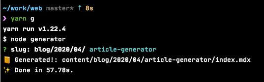

Gatsby で記事を書こうとしたとき、毎回ディレクトリを掘ったりファイルを生成するのはだるい。  
もしかしたらその手間のせいでモチベが著しく低下し、記事を書く機会の損失が発生するかもしれない。

そこで、その手間を抑えるための簡単な CLI ツールを作った。

## 今回の成果物

`vue-cli` とか `nest-cli` のような「対話式 CLI」のしょぼい版 



https://github.com/hasegayo/web/tree/master/generator

## 方針
- テンプレートファイル(.mdx)を用意し、必要箇所を置換して任意ディレクトリに書き出す
- なるべくコード量を少なく楽したいので良さげなライブラリを探す
- npm-scripts として実行する

## 調査
CLI ツールの作成に必要そうなライブラリ一覧は以下の記事に良くまとまっていた。
- [Node.jsでのCLIの作り方と便利なライブラリまとめ - Qiita](https://qiita.com/toshi-toma/items/ea76b8894e7771d47e10#minimist)

この中で**インタラクティブ（対話式）に値を入力できるもの**を条件として探したとき、 **[SBoudrias/Inquirer.js](https://github.com/SBoudrias/Inquirer.js/)** が要件を満たしていた。

## 実装
ディレクトリ構造はこんな感じ。
- root
  - generator
    - index.js
    - template.mdx

slug を入力したら `content/blog/${yyyy}/${mm}/${slug}` に `index.mdx` を吐くだけ。
- generator/index.js
```js
const inquirer = require("inquirer");
const fse = require('fs-extra');  // mkdirp (mkdir -p) を使いたかったので

const now = new Date();
const yyyy = now.getFullYear();
const mm = ("0"+(now.getMonth()+1)).slice(-2);
const dd = ("0"+now.getDate()).slice(-2);
const baseSlug = `blog/${yyyy}/${mm}`

const questions = [
  {
    type: 'input',
    name: 'slug',
    message: `slug: ${baseSlug}/`,
    validate: function(value) {
      if (value.match(/^[a-z-]+$/i)) {
        return true;
      }
      return 'Allow only "kebab-case"';
    }
  }
];

(async () => {
  // answers には questions の結果が { [${name}]: ${input} } 形式で入っている
  const answers = await inquirer.prompt(questions);
  const { slug } = answers;
  const generateDir = `content/${baseSlug}/${slug}`;
  await fse.mkdirp(generateDir);
  const template = await fse.readFile(`generator/template.mdx`);
  const newMdx = template.toString().replace("${date}", `${yyyy}-${mm}-${dd}`);
  await fse.writeFile(`${generateDir}/index.mdx`, newMdx);

  console.log(`📙 Generated!: ${generateDir}/index.mdx`);
})();
```

- template.mdx
```mdx
---
title:
date: '${date}'
tags: []
---

## 感想
```

npm script として実行する。
- package.json
```json
{
  ...
  "scripts": {
    "g": "node generator",
```

## 感想
コマンドラインからの入力値を読み取る泥臭い処理を書く必要がなく簡単に実装できた。
`inquirer.js` の [README.md](https://github.com/SBoudrias/Inquirer.js/#prompt-types) を読めばわかるが、入力タイプも `List` や `Checkbox` など豊富である。
いちばん気に入っているところは、特別な処理をいれなくても文字色がいい感じについてくれるところだったりする。
