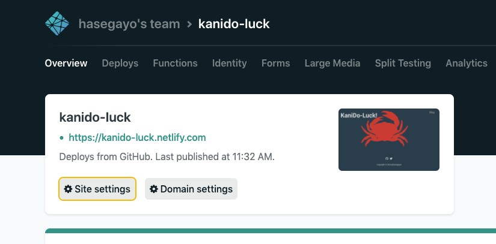

技術文章を残す場所がほしくなった。
- でも無料でやっていきたい
- ドメイン管理もしたくない(ゆくゆくするかも？)
- らくらくに SSL 化したい
- CDN でアセット類のキャッシュも利かせたい
- Markdown で書きたい
- js が埋め込めると嬉しいかもしれない
- テキストサイトなので爆速でレスポンスしたい

これらの要件を満たす技術スタックを探したら Gatsby を ~~GitHub Pages~~ Netlify で配信するやり方に行き着いた。
Netlify と GitHub Pages を比較したとき、Netlify の方が制限がゆるく楽にやっていけそうに感じた。

Netlify の注意点としては、[CI の build 時間が15分を超えると失敗する](https://www.netlify.com/blog/2016/10/18/how-our-build-bots-build-sites/#what-else-could-go-wrong)ということくらいか。
ただ、Gatsby の build くらいであれば、その点はまったく問題なさそうである。

フロントに関して、最近は Vue.js を書いているので VuePress を検討していたが、コイツはまだ歴史が浅いので苦労しそうということでやめておいた。
React は書いたことないけれど、良い機会なので Gatsby でやっていく。

## 今回の成果物
- このサイト: https://github.com/yua-chang/web

## ざっくり設計

### サイト構成
- `https://${任意のサブドメイン}.netlify.com`
  - `/`: トップページ（適当なものを置く）
  - `/blog/*`: 技術記事を書く
  
とりあえず、ミニマム構成で。

### デプロイ（記事更新）
GitHub と Netlify を連携させると push 時に連動して Gatsby を簡単にデプロイできるっぽい。  
travis.yml とか .github/workflows が不要ですごい。

## 導入手順

プロジェクトの初期化には `gatsby-cli` を使うのでインストールしておく。
```sh
npm install -g gatsby-cli
```

### 1. ベースとなるテンプレートを選ぶ
Gatsby には [Starter](https://www.gatsbyjs.org/starters?v=2) というテンプレート配布の仕組みがあり、適切なものを選択することで初期構築のコストを安くできる。
スターの数こそ少ないが、今回の用途と合致する [gatsby-starter-mdx-website-blog](https://www.gatsbyjs.org/starters/doakheggeness/gatsby-starter-mdx-website-blog/) を利用することにした。

初期化
```sh
gatsby new ${プロジェクト名} https://github.com/doakheggeness/gatsby-starter-mdx-website-blog
cd ${プロジェクト名}
```

テンプレートがちょっと古いので、各種パッケージをアップデートする。  
破壊的変更があって破滅しがちなのでしなくてもいい。
```sh
npx npm-check-updates -u
yarn install
```

今回はバージョンが上がったことで `react-helmet` の import 部分が破滅したので修正する。

対象:
- `src/components/layout.js`
- `src/components/seo.js`

```diff
- import Helmet from 'react-helmet'
+ import { Helmet } from 'react-helmet'
```

手元のスマホとかでサクッとレイアウトを確認できるように `package.json` を少しいじる。
```diff
  "scripts": {
-   "dev": "gatsby develop",
+   "dev": "gatsby develop --host 0.0.0.0",
```

以下のコマンドを実行し、ローカルで動かしてみる。
```sh
yarn dev
```

### 2. カスタマイズ
自分の好きなように `src/styles/global.css` とかいじる。
レイアウトを大幅に変更したい場合には、先ず [Gatsby のリファレンス](https://www.gatsbyjs.org/docs/) を読みおおよその構造を理解すること。
加えてコードリーディングしてみたり `graphql` の知識を蓄えたりしないと厳しいかもしれない。

### 3. デプロイ
Netlify は Gatsby との連携が簡単で、以下の手順でらくらくにデプロイできる。


- GitHub に push
- Netlify にログイン
  - [New site from Git]
  - [GitHub]
  - 対象の Repository を選択
  - [Deploy site] で build が始まる
- サブドメインは [Site setting] のところから変えられる
- 以降は、push する度に自動でデプロイがはじまる



## 感想
- 表示がはやいと嬉しい！
