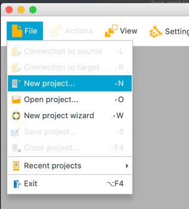
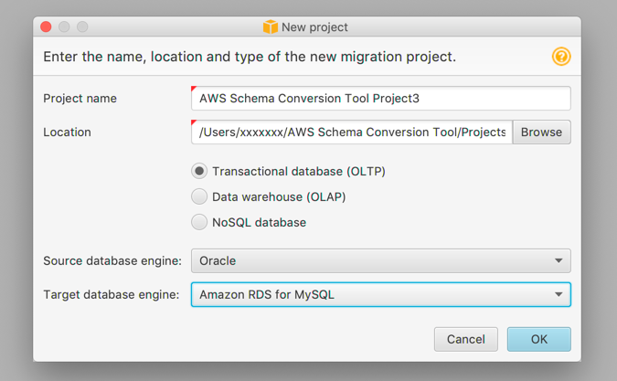
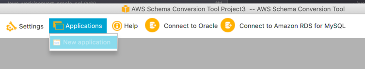
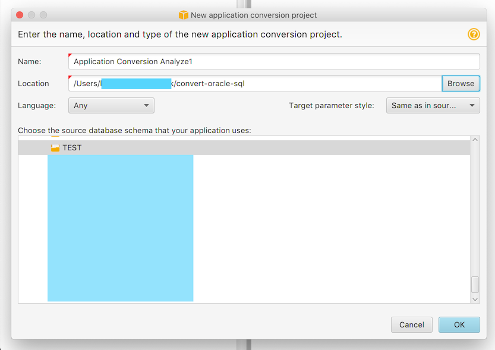
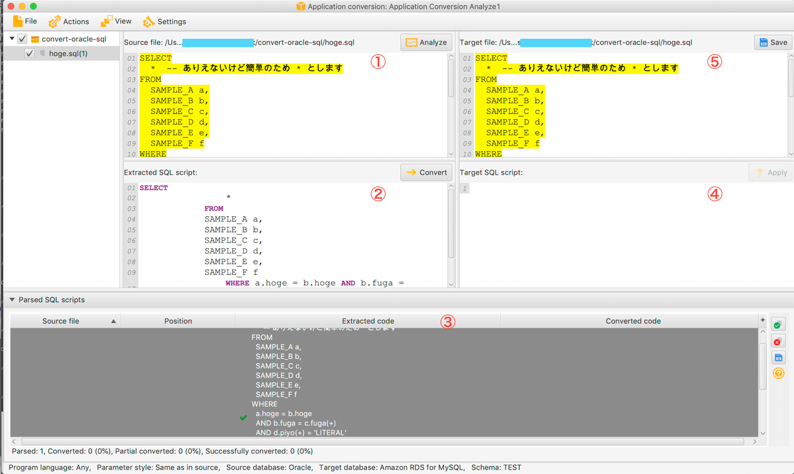

結論: [AWS Schema Conversion Tool](https://docs.aws.amazon.com/ja_jp/SchemaConversionTool/latest/userguide/CHAP_Converting.App.html) で自動変換すればいい

## ことの発端

ある日突然、古いシステムの移行・リプレイスを担当することになった。

Oracle のバージョンを上げたり、バックエンドを REST API として再構築してほしいという要件だ。 Oracle のバージョンを確認してみたところ **10g**……。
これには危険な匂いしか感じられず、さっそく頭が痛くなってくる。

気を取り直してアプリケーションで使っている SQL を確認したところ、以下のような見慣れない演算子`(+)`がかなりの頻度で使用されているようだった。

```sql
SELECT
  *  -- ありえないけど簡単のため * とします
FROM
  SAMPLE_A a,
  SAMPLE_B b,
  SAMPLE_C c,
  SAMPLE_D d,
  SAMPLE_E e,
  SAMPLE_F f
WHERE
  a.hoge = b.hoge
  AND b.fuga = 0
  AND b.fuga = c.fuga(+)
  AND d.piyo(+) = 'LITERAL'
  AND b.hage1 = d.peach(+)
  AND g.piyo(+) = 'LITERAL'
  AND b.hage2 = g.peach(+)
  AND a.foo = e.foo
  AND a.bar = f.bar
  AND a.hoge = f.hoge
  AND a.foo = f.foo
  AND a.apple = f.apple
  AND a.banana = f.banana
  AND a.orange = 'test'
```

いや、さっぱり意味がわからない。そもそもテーブルが正規化されていないとかリレーションすら貼られていないとかそういう問題も多々あるのだが、未知との遭遇となる `(+)` について知る必要がありそうだった。

## (+) は 11gR1 から非推奨となった外部結合演算子

> 『Oracle CEP CQL Language Reference』の比較条件に関する項には、非推奨の外部結合演算子(+)について記載されています。(+)結合演算子は使用しないことをお薦めします。後述するLEFT OUTER JOINおよびRIGHT OUTER JOIN構文を使用してください。

[24.3.9 非推奨の外部結合演算子(+) - Oracle Complex Event Processing](https://docs.oracle.com/cd/E16340_01/doc.1111/b55937/cep.htm#BABJBBIH)

どうやら下位互換性はあるけれど OUTER JOIN より制限が多く、読みづらいのでやめろという代物らしい。今後サポートされるかもわからないし、可能なら OUTER JOIN で書き換えておいた方が無難っぽい。

しかしながら、[19c のリファレンス](https://docs.oracle.com/cd/F19136_01/sqlrf/Joins.html#SQLRF-GUID-29A4584C-0741-4E6A-A89B-DCFAA222994A) を読むと「制限事項あるけどまあ使えはするよ、オススメは OUTER JOIN だけどね」くらいの温度感の記載となっている。
[英語版リファレンス](https://docs.oracle.com/en/database/oracle/oracle-database/19/sqlrf/Joins.html#GUID-29A4584C-0741-4E6A-A89B-DCFAA222994A) も読んでみたが、翻訳でニュアンスが変わったわけではなさそうだった。消し去ってしまいたいがそうすると困るシステム？開発者？も多いということだろうか。

とりあえず、例として上げた SQL は**熟練の職人にしか読めない**という問題点を孕んでいるため`OUTER JOIN`への書き換えを検討することとした。SQLを1から練り直すという案は工数とか諸々の関係で今回は考慮しないこととする。実行計画のスコアも致命的という値ではなかったので、まあ……。

## 案1. あたまで理解して書き換えてみる(NG)
結論から先にいうと、これは挫折した。

(+)演算子 と OUTER JOIN の対応については [ORACLE-BASE - SQL for Beginners (Part 5) : Joins](https://oracle-base.com/articles/misc/sql-for-beginners-joins#left-outer-join) を読むと"ある程度"は理解できる。

ふむふむ、
```sql
SELECT d.department_name,
       e.employee_name     
FROM   departments d
       LEFT OUTER JOIN employees e ON d.department_id = e.department_id
WHERE  d.department_id >= 30
ORDER BY d.department_name, e.employee_name;
```
と
```sql
SELECT d.department_name,
       e.employee_name      
FROM   departments d, employees e
WHERE  d.department_id = e.department_id (+) 
AND    d.department_id >= 30
ORDER BY d.department_name, e.employee_name;
```
が等価になるのか。RIGHT JOIN の用例も合わせて考えれば書き換えられそうだな。

……あれ？ `AND d.piyo(+) = 'LITERAL'` ってなんだ？？？  
`FROM句` に入るテーブルってどれになるの？ `SAMPLE_A a` のみ？  
でもそれだと辻褄が合わないような……そもそも何がしたいんだ元の SQL は！？

--> 諦めました。

## 案2. 実際に実行された SQL を確認してみる(NG)
Oracle DB は実行された SQL をテーブルに保持しているのでそれを見ればよいのでは案。暗黙的に (+) を OUTER JOIN に置換してから実行してる想定。

```sql
SELECT SQL_ID,FIRST_LOAD_TIME,SQL_TEXT
FROM V$SQL
ORDER BY FIRST_LOAD_TIME DESC;
```

--> がっつり `(+)` の混入した SQL が保存されてました。。。


## 案3. 自動変換で対処する(👍)
パフォーマンス・チューニングならともかく、劣悪な SQL を機械的に置換したいという目標のために人類の貴重な時間が割かれるというのは大きな損失に他ならない。
こんな泥臭いことは人間がやるべきではない！という考えのもと、自動で `(+)` を置換してくれるツールを探した。

探した結果、[AWS Schema Conversion Tool(AWS SCT)](https://docs.aws.amazon.com/ja_jp/SchemaConversionTool/latest/userguide/CHAP_Converting.App.html) しか見つからなかった。

### AWS SCT の準備
コイツはそもそも「オンプレで動かしているデータベースをまるまる AWS RDS に移行するのを支援する」ためのツールだ。その中の1機能である「アプリケーション SQL の変換機能」をいい感じに利用させてもらおう。

### インストール
[リファンレス](https://docs.aws.amazon.com/ja_jp/SchemaConversionTool/latest/userguide/CHAP_Installing.html) のとおりにやればいい。  
Oracle の JDBC ドライバのインストールも忘れずに(後ほど指定させられるので) 

### プロジェクト作成
SQL 変換機能は「データベーススキーマ変換プロジェクト」の**子**プロジェクトとしてしか作成できないという制約があるため、先に変換プロジェクトを作成する。



注意点としては**「RDS for Oracle」を選択した場合 SQL の変換不要と判断されるのか「SQL変換機能が使えない」**という点だ。変換後の SQL が他DBエンジン向けでも大きく乖離はないので、ここでは `RDS for MySQL` を選択しておこう



### Oracle DB に接続する
SQL 変換機能は対象となるスキーマの情報を元に変換を実施する（らしい）ので、対象となる Oracle DB に接続しておく必要がある。



未接続の場合は子プロジェクトは作成できないので、[Connect to Oracle] から接続先情報を入力し接続すること。

### 子プロジェクト(Application Conversion Project) 作成
Oracle DB への接続が完了したら、[Applications] から新しいプロジェクトを作成する。


- Location は sql ファイルなどが置かれた任意のフォルダを指定（ワークスペースとなる）
- Language は変換したいプロジェクトの言語を選択するのだが Any で良い
- Choose the source database... のとこは、対象となるスキーマをちゃんと選ぶ

### SQLの変換（to MySQL)
「アプリケーション変換プロジェクト」の UI は以下のとおり


- ①: 対象の SQL（を含むファイル）が表示される
  - [Analyze]を押して ③へ
- ③: ファイル内から対象となる SQL のコードブロックを選択する
  - 対象箇所をクリックすると、② に読み取られた SQL が表示される
- ②: 問題なければ [Convert] を押して ④ へ
- ④: 手動で SQL を調整（編集）できる
  - SQL が整ったら [Apply]
- ⑤: 最終的な SQL が表示される

この時点で `(+)` 演算子は消えているので、好きなエディタなどで Oracle 用に SQL を整えて完成。

## 今回の成果物

```sql
SELECT
  * -- ありえないけど簡単のため * とします
FROM
  sample_a a,
  sample_b b
  sample_e e,
  sample_f f,
LEFT OUTER JOIN sample_c c ON
  (b.fuga = c.fuga)
LEFT OUTER JOIN sample_d d ON
  (b.hage1 = d.peach
  AND d.piyo = 'JUNLE_MST')
LEFT OUTER JOIN sample_g g ON
  (b.hage2 = g.peach
  AND g.piyo = 'JUNLE_MST')
WHERE
  a.hoge = b.hoge
  AND b.fuga = 0
  AND a.foo = e.foo
  AND a.bar = f.bar
  AND a.hoge = f.hoge
  AND a.foo = f.foo
  AND a.apple = f.apple
  AND a.banana = f.banana
  AND a.orange = 'test'
```

答えを見ちゃえばなんとなく規則というか、対応関係がつかめてくるような気がしますが、 `(+)` の知識なんて今更ぜったいあたまに入れたくないので変換ツール樣様といったところ。
~~ほんとにちゃんと結合できてるのかこれ？けっきょく人間が読めるSQLになっている気がしない…~~

自動変換はすんなりできてしまいましたが、「SQL が変換前と同じ実行結果となるかどうか」はテストでしっかり確認することを忘れないようにしましょう（重要）。

## 感想
AWS にはなんでもあってすごい。  
他に良いツールを知っている人がいたら、ぜひ [@yua_chang - Twitter](https://twitter.com/yua_chang) へリプライで教えてほしい。
